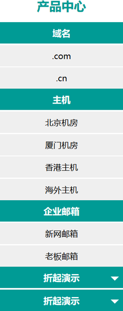

# hkkg

通用边栏菜单。



## 层次结构

```
.hkkg                       主类
    .hkkg-caption           大标题
    .hkkg-box1              一级box容器
        .hkkg-box2          二级box容器
            .hkkg-box3      三级box容器
        .hkkg-t1            容器内的一级标题
        .hkkg-t2            容器内的二级标题
        .hkkg-t3            容器内的三级标题

    .hkkg-box1.shrink       收起状态的box
    .hkkg-box1.shrinkable   可折叠的box

如果使用了shrink相关的模式，需要在document结尾脚本区加上如下代码：

<script>
  $(".hkkg .shrinkable > .hkkg-t1").click(function () {
    $(this).parent().toggleClass("shrink");
  });
</script>

方可使shrinkable的box完成状态切换。
```

